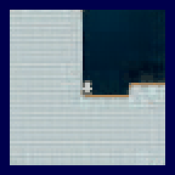
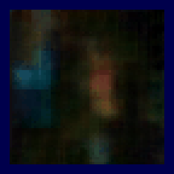
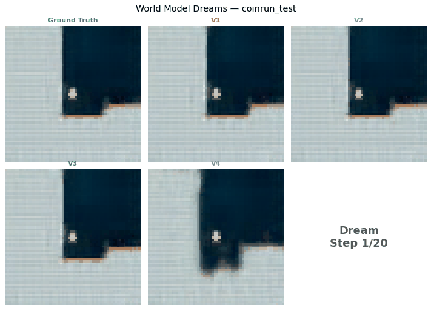
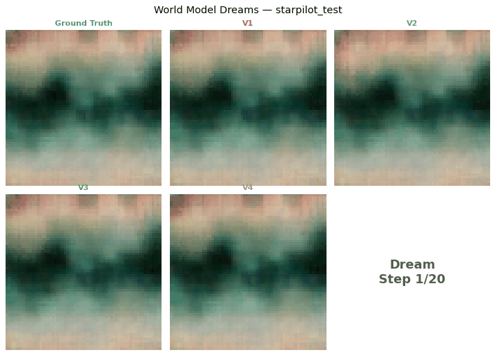

# World Models for Video Prediction in Procgen Games

A research implementation of an IRIS-style world model for multi-step video prediction in procedurally generated game environments. Built on [IRIS](https://github.com/eloialonso/iris) and [DIAMOND](https://github.com/eloialonso/diamond) by [General Intuition](https://www.generalintuition.com), the system learns to predict future game frames from past observations and player actions, without ever seeing the test level layouts during training.

The full research paper detailing our methodology, results, and analysis is available [here](https://github.com/Dev077/World-Models-for-Video-Prediction-in-Procgen-Games/blob/main/World%20Models%20for%20Video%20Prediction%20in%20Procgen%20Games.pdf).

| CoinRun | StarPilot |
|:---:|:---:|
|  |  |

---

## Pipeline Overview

1. Collect trajectories from Procgen environments.
2. Train a VQ-VAE to compress frames into discrete tokens.
3. Train an action-conditioned Transformer to predict future tokens.
4. Decode predictions back to pixels for dreaming and evaluation.

Games: `coinrun`, `starpilot`

---

## Project Layout

```text
.
├── Data-collection/
│   ├── collect_procgen_data.py
│   └── procgen_data/
│       ├── coinrun_train.h5
│       ├── coinrun_test.h5
│       ├── starpilot_train.h5
│       ├── starpilot_test.h5
│       └── samples/
├── VQ-VAE/
│   └── VQ-VAE.ipynb
├── Transformer/
│   ├── Transformer_v1.ipynb
│   ├── Transformer_v2.ipynb
│   ├── Transformer_v3.ipynb
│   └── Transformer_v4.ipynb
├── World_Model_Dreaming.ipynb
└── Evaluation.ipynb
```

---

## Data Availability

The raw gameplay data (HDF5 files of collected transitions) is not included in the repository due to file size. It is available as a download from the [GitHub Releases](../../releases) page. To regenerate the data from scratch instead, follow the Data Pipeline section below.

### Data Format

Each HDF5 file contains the following datasets:

| Dataset | dtype | Shape |
|---|---|---|
| frames | uint8 | [N, 64, 64, 3] |
| actions | int32 | [N] |
| next_frames | uint8 | [N, 64, 64, 3] |
| rewards | float32 | [N] |
| dones | bool | [N] |

Each file also stores metadata attributes including game name, number of levels, and mean episode reward.

---

## Environment Setup

The notebooks are written for Google Colab but can also run locally.

### 1. Create a Python environment

```bash
python3 -m venv .venv
source .venv/bin/activate
python -m pip install --upgrade pip
```

### 2. Install dependencies

```bash
pip install numpy h5py pillow matplotlib tqdm pandas
pip install torch torchvision
pip install procgen
pip install lpips
```

Some notebooks install packages inline. Procgen installation can vary by platform — if `pip install procgen` fails, follow the official [Procgen installation instructions](https://github.com/openai/procgen) for your environment.

---

## Data Pipeline

### Step 1: Collect Gameplay Data

```bash
cd Data-collection
python collect_procgen_data.py
```

Collects transition frames using a random policy. A random policy rather than a trained agent ensures broad, unbiased coverage of the observation space.

- 100,000 transitions from training levels (0–99) per game
- 20,000 transitions from test levels (100–199) per game

Generated files are saved to `Data-collection/procgen_data/`.

### Step 2: Train the VQ-VAE Tokenizer

Open `VQ-VAE/VQ-VAE.ipynb` and run all cells.

Trains the VQ-VAE on raw frame data, saves checkpoints, and encodes all frames into token files:

- `coinrun_train_tokens.h5` / `coinrun_test_tokens.h5`
- `starpilot_train_tokens.h5` / `starpilot_test_tokens.h5`

**Note on codebook collapse:** An initial configuration with embedding dim 512 and 1,024 codebook entries resulted in only 1–5% of entries receiving assignments. Reducing the embedding dimension to 64 and the codebook size to 512 resolved this, yielding stable training with over 90% codebook utilisation and a reconstruction loss of approximately 0.004. Codebook resets were explored but caused decoder instability — reducing the embedding dimension is the correct structural fix.

### Step 3: Train the Dynamics Transformer

Open one of the Transformer notebooks (`Transformer_v1.ipynb` through `Transformer_v4.ipynb`). The recommended variant is `Transformer/Transformer_v4.ipynb`.

Loads tokenized data, trains an action-conditioned autoregressive Transformer, and saves model checkpoints.

### Step 4: Generate Dream Visualisations

Open `World_Model_Dreaming.ipynb`.

Loads trained checkpoints and produces dream GIFs, context-to-dream comparison strips, cross-model comparison GIFs, free-dreaming rollouts, and dream degradation visualisations.

### Step 5: Evaluate

Open `Evaluation.ipynb`.

Compares all model variants and saves PSNR vs horizon plots, per-sample visual comparisons, and CSV/JSON summary results.

---

## Architecture

**TL;DR:** 64×64 RGB Frame → VQ-VAE → 8×8 Discrete Token Grid → Causal Transformer → Predicted Token Grid → VQ-VAE Decoder → Predicted Frame

### Overview

The model treats video prediction as a language modelling problem. Rather than predicting raw pixels in a continuous high-dimensional space, each frame is first compressed into a small grid of discrete tokens, analogous to words in a sentence. The transformer then learns to predict the next token at each position given all prior context, conditioned on the action the player took.

This framing is particularly well-suited to procedurally generated environments. Procgen levels share the same visual vocabulary — tiles, sprites, textures — but arrange them differently each episode. A model that has learned genuine dynamics generalises to new layouts. One that has memorised training configurations fails the moment the layout changes.

The two-stage design keeps the problem tractable. The VQ-VAE absorbs the visual complexity, producing a compact discrete representation of each frame. The transformer learns how those representations evolve over time. Freezing the tokenizer during transformer training isolates all differences in prediction quality to the transformer architecture alone.

### 1. VQ-VAE Tokenizer

Compresses 64×64×3 RGB frames into 8×8 grids of discrete token IDs — a 192× reduction in representation size.

| Property | Value |
|---|---|
| Input | 64×64×3 RGB frame |
| Output | 8×8 grid of integer token IDs (64 tokens per frame) |
| Codebook | 512 entries, embedding dim 64 |
| Codebook update | Exponential Moving Average (decay=0.99) |

The encoder applies three strided convolutional layers (stride 2) with residual blocks and batch normalisation, producing an 8×8×64 feature map. Each spatial position is assigned to its nearest codebook entry by Euclidean distance. The decoder mirrors the encoder using transposed convolutions. Gradients flow through the non-differentiable quantisation step via a straight-through estimator.

### 2. Autoregressive Transformer

Predicts future frame token sequences conditioned on player actions.

| Property | Value |
|---|---|
| Input | Interleaved frame tokens and action tokens |
| Sequence length | 324 tokens (5 frames × 64 tokens + 4 actions) |
| Visual vocabulary | 512 entries |
| Action tokens | Offset by 512 to avoid ID collisions with visual tokens |
| Positional encoding | Learned temporal and spatial embeddings, summed |

Each layer applies multi-head causal self-attention followed by a feed-forward network with GELU activation, layer normalisation, and residual connections. The loss is cross-entropy computed over frame token positions only. Gradient clipping with a maximum norm of 1.0 is applied throughout training.

Four configurations are evaluated, each exploring a different point in the capacity–regularisation trade-off:

| Config | d_model | Layers | Dropout | Weight Decay | Label Smoothing | Context Frames | Optimiser |
|---|---|---|---|---|---|---|---|
| V1 | 384 | 8 | 0.1 | — | — | 4 | Adam |
| V2 | 256 | 4 | 0.3 | 0.01 | 0.1 | 4 | AdamW |
| V3 | 256 | 6 | 0.2 | 0.01 | 0.1 | 4 | AdamW |
| V4 | 384 | 8 | 0.1 | 0.01 | — | 5 | AdamW |

- **V1 — High-Capacity Baseline.** Large model, minimal regularisation, no validation monitoring. Sets the upper bound on training performance.
- **V2 — Heavy Regularisation.** Reduced capacity with strong dropout, weight decay, and label smoothing. The first configuration to track validation loss on unseen levels during training.
- **V3 — Middle Ground.** Intermediate capacity and regularisation, targeting a balance between V1 and V2.
- **V4 — High-Capacity with Weight Decay.** Matches V1 in capacity, adds weight decay and a longer context window. Tests whether weight decay alone is sufficient regularisation for a large model.

V1 uses argmax decoding at inference. V2 through V4 use categorical sampling with temperature scaling to avoid mode collapse.

---

## Key Results

### Predicted Rollouts on Unseen Levels

| CoinRun | StarPilot |
|:---:|:---:|
|  |  |

### CoinRun — PSNR on Unseen Levels

| Config | H=1 | H=5 | H=10 | H=20 |
|---|---|---|---|---|
| V1 | 19.83 dB | 17.22 dB | 15.90 dB | 14.84 dB |
| V2 | 20.65 dB | 17.24 dB | 15.28 dB | 13.97 dB |
| V3 | 19.27 dB | 14.88 dB | 12.22 dB | 10.90 dB |
| V4 | 18.65 dB | 14.14 dB | 11.38 dB | 11.33 dB |

V1 achieves the highest training performance but carries a generalisation gap of 4.19 dB at horizon 1. V2 closes that gap to 1.34 dB and outperforms V1 on unseen levels outright. V3 and V4 sit between the two at short horizons but degrade more rapidly over longer rollouts, falling below both V1 and V2 by horizon 10.

On StarPilot, all configurations generalise with near-zero gaps, consistent with the game's uniform scrolling structure.

---

## Colab and Paths

The notebooks are configured for Google Colab and use paths under `/content/drive/MyDrive/`. Typical expected folders in Drive:

- `procgen_data`
- `procgen_tokenized`
- `procgen_checkpoints`
- `transformer_checkpoints` (and versioned variants)

If running locally, update the path variables in each notebook accordingly.

---

## Reproducibility

The repository contains multiple Transformer iterations (V1–V4). Results differ by architecture and checkpoint. Final numbers depend on the specific checkpoints loaded in `World_Model_Dreaming.ipynb` and `Evaluation.ipynb`.

---

## Troubleshooting

- If data files are missing, run data collection first and verify HDF5 paths.
- If token files are missing, run the VQ-VAE tokenization cells before Transformer training.
- If a checkpoint fails to load, verify that the model architecture matches the checkpoint version.

---

## Acknowledgements

This project builds on [IRIS](https://github.com/eloialonso/iris) and [DIAMOND](https://github.com/eloialonso/diamond) (Micheli et al., 2023; Alonso et al., 2024), developed by [General Intuition](https://www.generalintuition.com). VQ-VAE by van den Oord et al. (2017). Game environments provided by [Procgen](https://github.com/openai/procgen) (Cobbe et al., 2020).
